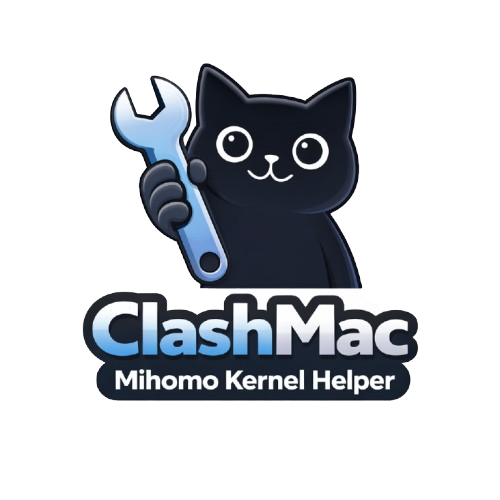

<div align="center">
  
</div>

# 📦 [ClashMac Mihomo Kernel Helper](https://github.com/lukuochiang/clashmac-mihomo-kernel-helper)

 是一个专注于 **mihomo 内核下载、管理、切换** 的命令行助手，避免重复下载、支持按时间戳管理备份，与 GUI 完全分离职责。<br/>
 本仓库仅管理 **mihomo 内核**，不依赖 GUI，也不启动或控制内核运行状态，仅适用 [**_ClashMac_**](https://github.com/666OS/ClashMac)

---

## 🧠 设计理念

**职责分离 → 工具稳定、可维护、可追溯**

- **脚本负责版本管理**  
  - 下载 mihomo 内核  
  - 按时间戳备份历史版本  
  - 切换指定版本  
  - 避免重复下载

- **GUI 负责运行内核**  
  - 启动/重启 mihomo  
  - 权限授权（防火墙、网络）  
  - 进程守护

---

## 📁 脚本区别与选择

本项目提供三个功能不同的脚本，满足不同使用场景：

| 脚本名称                                   | 功能特点 | 适用场景 |
|----------------------------------------|---------|---------|
| **clashmac_mihomo-kernel_helper.sh**   | 基础命令行工具，功能全面 | 脚本集成、自动化任务 |
| **clashmac_mihomo-kernel_installer.sh** | 最小化安装脚本，仅含安装功能 | 一键安装场景、快速部署 |
| **clashmac_mihomo-kernel_manager.sh**  | 交互式菜单界面，功能最丰富 | 手动操作、新手友好 |

## 📌 功能总览

### 基础功能（所有脚本）
| 命令                  | 功能                        |
| ------------------- | -------------------------- |
| `status`            | 显示当前核心 & 最新备份版本 |
| `list`              | 按时间戳降序列出所有备份    |
| `install [version]` | 下载/安装指定版本（默认最新） |
| `switch <version>`  | 切换到指定备份版本          |
| `help`              | 显示帮助说明               |

### 交互式界面专属功能
| 功能                  | 描述                        |
| ------------------- | -------------------------- |
| **健康检查**         | 检查内核运行状态和系统环境   |
| **杀掉内核进程**     | 强制终止 mihomo 内核进程    |
| **重启 ClashMac**    | 重新启动 ClashMac 应用程序  |
| **交互式菜单**       | 直观的图形化操作界面        
---


## 🚀 快速开始

### 1. 一键安装（推荐）

```bash
curl -fsSL https://raw.githubusercontent.com/lukuochiang/clashmac-mihomo-kernel-helper/refs/heads/main/scripts/clashmac_mihomo-kernel_helper.sh \
  -o /tmp/mihomo.sh \
&& chmod +x /tmp/mihomo.sh \
&& /tmp/mihomo.sh install
```

```bash
curl -fsSL https://raw.githubusercontent.com/lukuochiang/clashmac-mihomo-kernel-helper/refs/heads/main/scripts/clashmac_mihomo-kernel_installer.sh \
  -o /tmp/mihomo.sh \
&& chmod +x /tmp/mihomo.sh \
&& /tmp/mihomo.sh install
```

```bash
curl -fsSL https://raw.githubusercontent.com/lukuochiang/clashmac-mihomo-kernel-helper/refs/heads/main/scripts/clashmac_mihomo-kernel_manager.sh \
  -o /tmp/mihomo.sh \
&& chmod +x /tmp/mihomo.sh \
&& /tmp/mihomo.sh install
```


### 2. 手动安装
```bash
# 克隆仓库
git clone https://github.com/lukuochiang/clashmac-mihomo-kernel-helper.git
cd clashmac-mihomo-kernel-helper

# 给脚本执行权限
chmod +x scripts/*.sh

# 运行 TUI 界面（推荐）
./scripts/clashmac_mihomo-kernel_tui.sh

# 或运行基础命令行工具
./scripts/clashmac_mihomo-kernel_helper.sh status
```
---

## 🎯 使用指南

### 基础命令行工具使用

```bash
# 查看当前状态
./scripts/clashmac_mihomo-kernel_helper.sh status

# 列出所有备份
./scripts/clashmac_mihomo-kernel_helper.sh list

# 安装最新版本
./scripts/clashmac_mihomo-kernel_helper.sh install

# 安装指定版本
./scripts/clashmac_mihomo-kernel_helper.sh install v1.19.9

# 切换到指定版本
./scripts/clashmac_mihomo-kernel_helper.sh switch darwin-amd64-v1.19.9
```

### 交互式界面使用

1. 启动 交互式 界面：
   ```bash
   ./scripts/clashmac_mihomo-kernel_manager.sh
   ```

2. 使用菜单导航：
  - 使用数字键选择功能
  - 按 Enter 确认选择
  - 按照提示完成操作

3. 核心功能流程：
  - **安装/更新**：选择 GitHub 源 → 选择版本分支 → 自动下载安装
  - **切换版本**：查看可用版本 → 选择版本 → 自动切换
  - **健康检查**：自动诊断内核和系统状态 → 显示结果

---

## 🛠️ 高级特性

### 多源支持

脚本支持从多个 GitHub 源下载 mihomo 内核：
- **MetaCubeX**：官方原版内核
- **vernesong**：Smart 版本内核

### 自动架构检测

自动检测系统架构（arm64/amd64），下载匹配的内核版本。

### 智能备份管理

- 按时间戳命名备份文件：`mihomo.backup.<version>.<timestamp>`
- 保留完整历史备份，方便追溯和回滚
- 避免重复下载相同版本

### 日志管理

TUI 界面提供日志查看功能：
- 查看最新日志条目
- 实时监控日志更新
- 清理旧日志文件

---

## 📋 系统要求

- **操作系统**：macOS 10.15+
- **架构**：Intel (amd64) 或 Apple Silicon (arm64)
- **依赖**：
  - `bash` (默认已安装)
  - `curl` (默认已安装)
  - `git` (可选，用于克隆仓库)
  - `gzip` (默认已安装，用于日志压缩)

---

## ❗ FAQ

**Q: 为什么没有自动重启内核？**  
A: GUI 管理内核运行态更稳定，脚本只负责版本切换  

**Q: 为什么需要备份？**  
A: 避免误覆盖，可随时切换回旧版本  

**Q: 为什么按时间戳排序？**  
A: YYYYMMDD_HHMMSS 保证历史顺序，可追溯

---

## 📜 许可协议
本项目采用 MIT 许可证 - 查看 [LICENSE](LICENSE) 文件了解详情。

## 致谢

特别感谢以下项目和开发者：
- [MetaCubeX/mihomo](https://github.com/MetaCubeX/mihomo)
- [vernesong/mihomo](https://github.com/vernesong/mihomo)
- [666OS/ClashMac](https://github.com/666OS/ClashMac)
